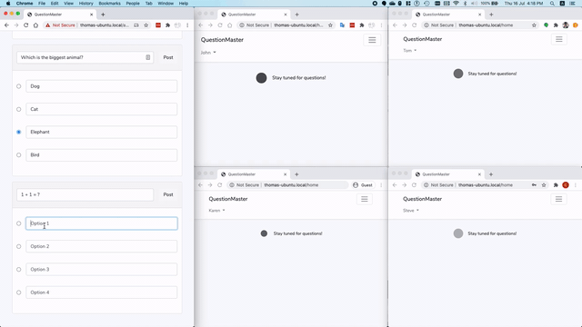

# QuestionMaster

This project aims to implement a real-time questionnaire game using sockets. 

## Features

* Admin can create questions on the fly and broadcast them to players
* Players will be given 10 seconds to answer the questions
* After the 10 seconds, player's input will be disabled and the game will reveal the answer and whether the player get it right or wrong
* The player's response will be saved to database
* The answer-reveal screen will stay until the next question arrives

## Stack used
* React and Laravel Blade as front-end
* Laravel as question handler and main backend
* NodeJS and socket.io as websocket service provider
* JWT as authentication

## Installation

1. Clone the repository
2. `docker-compose up`
3. `cd` into `.\QuestionMaster` and download dependencies by running `composer install` and `yarn`
4. `yarn run watch`
5. `nodemon socket-server.js`
6. Inside the php image, run `php artisan queue:listen`
